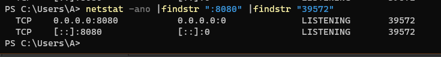

## Java并发编程常见问题2

### Q7-1：连接池的一些概念

连接池一般对外提供获得连接、归还连接的接口给客户端使用，并暴露最小空闲连接数、最大连接数等可配置参数，在内部则实现连接建立、连接心跳保持、连接管理、空闲连接回收、连接可用性检测等功能。连接池的结构示意图，如下所示：


业务项目中经常会用到的连接池，主要是数据库连接池、Redis 连接池和 HTTP 连接池。

**如何鉴别客户端SDK是否基于连接池**

在使用三方客户端进行网络通信时，我们首先要确定客户端 SDK 是否是基于连接池技术实现的。我们知道，TCP 是面向连接的基于字节流的协议：面向连接，意味着连接需要先创建再使用，创建连接的三次握手有一定开销；

基于字节流，意味着字节是发送数据的最小单元，TCP 协议本身无法区分哪几个字节是完整的消息体，也无法感知是否有多个客户端在使用同一个 TCP 连接，TCP 只是一个读写数据的管道。

如果客户端 SDK 没有使用连接池，而直接是 TCP 连接，那么就需要考虑每次建立 TCP 连接的开销，**并且因为 TCP 基于字节流，在多线程的情况下对同一连接进行复用，可能会产生线程安全问题**。

我们先看一下涉及 TCP 连接的客户端 SDK，对外提供 API 的三种方式。在面对各种三方客户端的时候，只有先识别出其属于哪一种，才能理清楚使用方式。大部分的TCP客户端SDK（包括JDK内置的TCP通讯框架）可以分为以下三类API:

- **连接池和连接分离的 API：**有一个 XXXPool 类负责连接池实现，先从其中获得连接XXXConnection，然后用获得的连接进行服务端请求，完成后使用者需要归还连接。通常，XXXPool 是线程安全的，可以并发获取和归还连接，而 XXXConnection 是非线程安全的。对应到连接池的结构示意图中，XXXPool 就是右边连接池那个框，左边的客户端是我们自己的代码。

- **内部带有连接池的 API：**对外提供一个 XXXClient 类，通过这个类可以直接进行服务端请求；这个类内部维护了连接池，SDK 使用者无需考虑连接的获取和归还问题。一般而言，XXXClient 是线程安全的。对应到连接池的结构示意图中，整个 API 就是蓝色框包裹的部分。

- **非连接池的 API：**一般命名为 XXXConnection，以区分其是基于连接池还是单连接的，而不建议命名为 XXXClient 或直接是 XXX。直接连接方式的 API 基于单一连接，每次使用都需要创建和断开连接，性能一般，且通常不是线程安全的。对应到连接池的结构示意图中，这种形式相当于没有右边连接池那个框，客户端直接连接服务端创建连接。

[^注意]: 虽然上面提到了 SDK 一般的命名习惯，但不排除有一些客户端特立独行，因此在使用三方 SDK 时，一定要先查看官方文档了解其最佳实践，或是在类似 Stackoverflow 的网站搜索 XXX threadsafe/singleton 字样看看大家的回复，也可以一层一层往下看源码，直到定位 到原始 Socket 来判断 Socket 和客户端 API 的对应关系。

明确了 SDK 连接池的实现方式后，我们就大概知道了使用 SDK 的最佳实践：

如果是分离方式，那么连接池本身一般是线程安全的，可以复用。每次使用需要从连接池获取连接，使用后归还，归还的工作由使用者负责。

如果是内置连接池，SDK 会负责连接的获取和归还，使用的时候直接复用客户端。

如果 SDK 没有实现连接池（大多数中间件、数据库的客户端 SDK 都会支持连接池），那通常不是线程安全的，而且短连接的方式性能不会很高，使用的时候需要考虑是否自己封装一个连接池。


### Q7-2：Jedis的连接池机制和源码剖析

#### 1.例子

以 Java 中用于操作 Redis 最常见的库 Jedis 为例，从源码角度分析下 Jedis类到底属于哪种类型的 API，直接在多线程环境下复用一个连接会产生什么问题，以及如何用最佳实践来修复这个问题。

首先，向 Redis 初始化 2 组数据，Key=a、Value=1，Key=b、Value=2：

```java
private static JedisPool jedisPool = new JedisPool("127.0.0.1", 6379);

@PostConstruct
public void init() {
    try (Jedis jedis = new Jedis("127.0.0.1", 6379)) {
        Assert.isTrue("OK".equals(jedis.set("a", "1")), "set a = 1 return OK");
        Assert.isTrue("OK".equals(jedis.set("b", "2")), "set b = 2 return OK");
    }
    Runtime.getRuntime().addShutdownHook(new Thread(() -> {
        jedisPool.close();
    }));
}
```

然后，启动两个线程，共享操作同一个 Jedis 实例，每一个线程循环 1000 次，分别读取Key 为 a 和 b 的 Value，判断是否分别为 1 和 2。运行后，结果很意外。

程序并没有一直输出正确的结果。

#### 2.Jedis源代码剖析

查看Jedis源代码发现，Jedis 继承了 BinaryJedis，BinaryJedis 中保存了单个 Client 的实例，Client最终继承了 Connection，Connection 中保存了单个 Socket 的实例，和 Socket 对应的两个读写流。因此，一个 Jedis 对应一个 Socket 连接。

```java
public class Jedis extends BinaryJedis implements JedisCommands, MultiKeyCommands, AdvancedJedisCommands, ScriptingCommands, BasicCommands, ClusterCommands, SentinelCommands, ModuleCommands {
}

public class BinaryJedis implements BasicCommands, BinaryJedisCommands, MultiKeyBinaryCommands, AdvancedBinaryJedisCommands, BinaryScriptingCommands, Closeable {
    protected Client client;
    protected Transaction transaction;
    protected Pipeline pipeline;
    private final byte[][] dummyArray;

    public BinaryJedis() {
        this.client = null;
        this.transaction = null;
        this.pipeline = null;
        this.dummyArray = new byte[0][];
        this.client = new Client();
    }
    
public class Client extends BinaryClient implements Commands {
}
    
public class BinaryClient extends Connection {
    
}

public class Connection implements Closeable {
    private static final byte[][] EMPTY_ARGS = new byte[0][];
    private String host = "localhost";
    private int port = 6379;
    private Socket socket;
    private RedisOutputStream outputStream;
    private RedisInputStream inputStream;
}
    
```

类图如下：


如下是Connection类的sendCommand方法，用于发送redis指令。

```java
private static void sendCommand(final RedisOutputStream os, final byte[] command, final byte[]... args) 
{ 
    try { 
        os.write(ASTERISK_BYTE); 
        os.writeIntCrLf(args.length + 1);
        os.write(DOLLAR_BYTE);
        os.writeIntCrLf(command.length);
		os.write(command); 
        os.writeCrLf(); 
        for (final byte[] arg : args) {
            os.write(DOLLAR_BYTE); 
            os.writeIntCrLf(arg.length); 
            os.write(arg); 
            os.writeCrLf(); 
        } 
    } catch (IOException e) {
        throw new JedisConnectionException(e); 
    } 
}
```

从上述代码可以看出来，Jedis发送redis指令时是直接操作RedisOutputStream对象写入字节的。我们在多线程环境下复用 Jedis 对象，其实就是在复用 RedisOutputStream。**如果多个线程在执行操作，那么既无法确保整条命令以一个原子操作写入 Socket，也无法确保写入后、读取前没有其他数据写到远端** 。看到这里，我们应该理解了，为啥多线程情况下使用 Jedis 对象操作 Redis 会出现各种奇怪的问题：

- 以上代码，会造成写操作互相干扰，多条redis指令相互穿插，redis服务端会认为这些不是合法的指令，此时redis服务端会关闭客户端连接，导致连接断开；
- 例子代码中，线程1和2先后发送了get a和get b的指令，redis也返回了值1和值2，但是如果线程2先读取了数据1就会出现数据错乱的问题。

#### 3.正确的方法

正确的方法是，使用Jedis框架中的另一个安全类型JedisPool来获得Jedis实例。如下：

```java
private static JedisPool jedisPool = new JedisPool("127.0.0.1", 6379);

@GetMapping("/right1")
public String right() throws InterruptedException {

    new Thread(() -> {
        try (Jedis jedis = jedisPool.getResource()) {
            for (int i = 0; i < 1000; i++) {
                String result = jedis.get("a");
                if (!"1".equals(result)) {
                    log.warn("Expect a to be 1 but found {}", result);
                    return;
                }
            }
            log.info("execute successfully- {}", Thread.currentThread().getName());
        }
    }).start();
    new Thread(() -> {
        try (Jedis jedis = jedisPool.getResource()) {
            for (int i = 0; i < 1000; i++) {
                String result = jedis.get("b");
                if (!"2".equals(result)) {
                    log.warn("Expect b to be 2 but found {}", result);
                    return;
                }
            }
            log.info("execute successfully- {}", Thread.currentThread().getName());
        }
    }).start();
    TimeUnit.SECONDS.sleep(5);
    return "OK";

}
```

以上代码可以保证不会有线程安全问题。此外，我们最好通过shutdownHook方法，在程序退出之前关闭JedisPool.

```java
Runtime.getRuntime().addShutdownHook(new Thread(() -> {
    jedisPool.close();
}));
```

JedisPool 的 getResource 方法在拿到 Jedis 对象后，将自己设置为了连接池。连接池JedisPool，继承了 JedisPoolAbstract，而后者继承了抽象类 Pool，Pool 内部维护了Apache Common 的通用池 GenericObjectPool。JedisPool 的连接池就是基于GenericObjectPool 的。

看到这里我们了解了，Jedis 的 API 实现是我们说的三种类型中的第一种，也就是连接池和连接分离的 API，JedisPool 是线程安全的连接池，Jedis 是非线程安全的单一连接。


### Q7-3：Http客户端连接池机制和源码剖析

#### 1.池复用的一些概念

池一定是用来复用的，否则其使用代价会比每次创建单一对象更大。对连接池来说更是如此，原因如下：

创建连接池的时候很可能一次性创建了多个连接，大多数连接池考虑到性能，会在初始化的时候维护一定数量的最小连接（毕竟初始化连接池的过程一般是一次性的），可以直接使用。如果每次使用连接池都按需创建连接池，那么很可能你只用到一个连接，但是创建了 N 个连接。

连接池一般会有一些管理模块，也就是连接池的结构示意图中的绿色部分。举个例子，大多数的连接池都有闲置超时的概念。连接池会检测连接的闲置时间，定期回收闲置的连接，把活跃连接数降到最低（闲置）连接的配置值，减轻服务端的压力。一般情况下，闲置连接由独立线程管理，启动了空闲检测的连接池相当于还会启动一个线程。此外，有些连接池还需要独立线程负责连接保活等功能。因此，启动一个连接池相当于启动了 N 个线程。

#### 2.例子

除了使用代价，连接池不释放，还可能会引起线程泄露。接下来，我就以 Apache HttpClient 为例，和你说说连接池不复用的问题。首先，创建一个 **CloseableHttpClient**，设置使用PoolingHttpClientConnectionManager 连接池并启用空闲连接驱逐策略，最大空闲时间为 60 秒，然后使用这个连接来请求一个会返回 OK 字符串的服务端接口：

```java
@GetMapping("wrong2-1")
public String wrong1() {
    CloseableHttpClient client = HttpClients.custom()
        .setConnectionManager(new PoolingHttpClientConnectionManager())
        .evictIdleConnections(60, TimeUnit.SECONDS).build();
    try (CloseableHttpResponse response = client.execute(new HttpGet("http://127.0.0.1:8080/q7/test"))) {
        return EntityUtils.toString(response.getEntity());
    } catch (Exception ex) {
        ex.printStackTrace();
    }
    return null;
}

@GetMapping("/test")
public String test() {
    return "OK";
}
```

以上代码执行多次后，在windows下使用jstack查看应用的线程情况(先用netstat -apn|findstr ":8080"查找8080端口的进程id)，发现应用创建了大量的名为Connection evictor的线程，并且无法关闭，如下图所示：


对这个接口进行几秒的压测（1 个并发 1 个连接）可以看到，已经建立了三千多个 TCP 连接到 8080端口（其中有 1 个是压测客户端到 Tomcat 的连接，大部分都是 HttpClient 到 Tomcat 的连接）：


好在有了空闲连接回收的策略，60 秒之后连接处于 CLOSE_WAIT 状态，最终彻底关闭。以上现象可以说明代码在每次访问时都创建了连接池和大量TCP连接.

以上测试已经可以证明，**CloseableHttpClient 属于第二种模式，即内部带有连接池的 API，其背后是连接池，最佳实践一定是复用**。复用方式很简单，你可以把 CloseableHttpClient 声明为 static，只创建一次，并且在JVM 关闭之前通过 addShutdownHook 钩子关闭连接池，在使用的时候直接使用CloseableHttpClient 即可，无需每次都创建。

#### 3.正确的方法

我们修改下上述代码，确保每次接口访问完毕后连接池可以关闭。

```java
@GetMapping("wrong2-2")
public String wrong2() {
    try (CloseableHttpClient client = HttpClients.custom()
         .setConnectionManager(new PoolingHttpClientConnectionManager())
         .evictIdleConnections(60, TimeUnit.SECONDS).build();
         CloseableHttpResponse response = client.execute(new HttpGet("http://127.0.0.1:8080/q7/test"))) {
        return EntityUtils.toString(response.getEntity());
    } catch (Exception ex) {
        ex.printStackTrace();
    }
    return null;
}
```

对上述代码进行同样压测后发现，以上现象不再出现, 如下图所示，不再有大量未释放的连接。



JMeter压测60秒的吞吐量报告如下,大约224左右。


使用复用连接池的方案改进上述代码如下：

```java
private static CloseableHttpClient httpClient = null;
static {
        httpClient = HttpClients.custom().setMaxConnPerRoute(1).setMaxConnTotal(1).evictIdleConnections(60, TimeUnit.SECONDS).build();
        Runtime.getRuntime().addShutdownHook(new Thread(() -> {
            try {
                httpClient.close();
            } catch (IOException ignored) {
            }
        }));
    }

@GetMapping("right2")
public String right() {
    try (CloseableHttpResponse response = httpClient.execute(new HttpGet("http://127.0.0.1:8080/q7/test"))) {
        return EntityUtils.toString(response.getEntity());
    } catch (Exception ex) {
        ex.printStackTrace();
    }
    return null;
}
```

JMeter压测60秒的吞吐量报告如下：大约450左右，性能提升是很明显的。


如此大的性能差异显然是因为 TCP 连接的复用。你可能注意到了，刚才定义连接池时，我将最大连接数设置为 1。所以，复用连接池方式复用的始终应该是同一个连接，而新建连接池方式应该是每次都会创建新的 TCP 连接。

#### 4. 连接池的配置

为方便根据容量规划设置连接处的属性，连接池提供了许多参数，包括最小（闲置）连接、最大连接、闲置连接生存时间、连接生存时间等。其中，最重要的参数是**最大连接数**，它决定了连接池能使用的连接数量上限，达到上限后，新来的请求需要等待其他请求释放连接。

但，**最大连接数不是设置得越大越好**。如果设置得太大，不仅仅是客户端需要耗费过多的资源维护连接，更重要的是由于服务端对应的是多个客户端，每一个客户端都保持大量的连接，会给服务端带来更大的压力。这个压力又不仅仅是内存压力，可以想一下如果服务端的网络模型是一个 TCP 连接一个线程，那么几千个连接意味着几千个线程，如此多的线程会造成大量的线程切换开销。

当然，**连接池最大连接数设置得太小，很可能会因为获取连接的等待时间太长，导致吞吐量低下，甚至超时无法获取连接**。


### Q7-4：数据库客户端连接池机制剖析

#### 1.例子

接下来，我们就模拟下压力增大导致数据库连接池打满的情况，来实践下如何确认连接池的使用情况，以及有针对性地进行参数优化。

首先，定义一个用户注册方法，通过 @Transactional 注解为方法开启事务。其中包含了500 毫秒的休眠，一个数据库事务对应一个 TCP 连接，所以 500 多毫秒的时间都会占用数据库连接：

```java
@RestController
@RequestMapping("q7")
@Slf4j
public class ImproperDataSourcePoolSizeController {
    @Autowired
    private UserService userService;

    @GetMapping("testDS")
    public Object test() {
        return userService.register();
    }
}

@Service
public class UserService {
    @Autowired
    private UserRepository userRepository;

    @Transactional
    public User register() {
        User user = new User();
        user.setName("new-user-" + System.currentTimeMillis());
        userRepository.save(user);
        try {
            TimeUnit.MILLISECONDS.sleep(500);
        } catch (InterruptedException e) {
            e.printStackTrace();
        }
        return user;
    }
}
```

随后，修改配置文件启用 register-mbeans，使 Hikari 连接池能通过 JMX MBean 注册连接池相关统计信息，方便观察连接池：

```properties
spring.datasource.hikari.register-mbeans=true
```

启动程序并通过 JConsole 连接进程后，可以看到默认情况下最大连接数为 10：


使用JMeter开启10个线程压测，在JConsole界面可以看到连接数一下子从0到10，有20个线程在等待获取连接。


不久就出现了无法获取数据库连接的异常，如下所示：

```verilog

```

#### 2.解决方法

从异常信息中可以看到，数据库连接池是 HikariPool，解决方式很简单，修改一下配置文件，调整数据库连接池最大连接参数到 50 即可。

```properties
spring.datasource.hikari.maximum-pool-size=50
```

然后，再观察一下这个参数是否适合当前压力，满足需求的同时也不占用过多资源。从监控来看这个调整是合理的，有一半的富余资源，再也没有线程需要等待连接了：


在这个 Demo 里，我知道压测大概能对应使用 25 左右的并发连接，所以直接把连接池最大连接设置为了 50。在真实情况下，只要数据库可以承受，你可以选择在遇到连接超限的时候先设置一个足够大的连接数，然后观察最终应用的并发，再按照实际并发数留出一半的

余量来设置最终的最大连接。其实，看到错误日志后再调整已经有点儿晚了。更合适的做法是，**对类似数据库连接池的重要资源进行持续检测，并设置一半的使用量作为报警阈值，出现预警后及时扩容**。

在这里我是为了演示，才通过 JConsole 查看参数配置后的效果，生产上需要把相关数据对接到指标监控体系中持续监测。

**这里要强调的是，修改配置参数务必验证是否生效，并且在监控系统中确认参数是否生效、是否合理。**

#### 3.总结

今天，我以三种业务代码最常用的 Redis 连接池、HTTP 连接池、数据库连接池为例，和你探讨了有关连接池实现方式、使用姿势和参数配置的三大问题。

客户端 SDK 实现连接池的方式，包括池和连接分离、内部带有连接池和非连接池三种。要正确使用连接池，就必须首先鉴别连接池的实现方式。比如，Jedis 的 API 实现的是池和连接分离的方式，而 Apache HttpClient 是内置连接池的 API。

对于使用姿势其实就是两点，一是确保连接池是复用的，二是尽可能在程序退出之前显式关闭连接池释放资源。连接池设计的初衷就是为了保持一定量的连接，这样连接可以随取随用。从连接池获取连接虽然很快，但连接池的初始化会比较慢，需要做一些管理模块的初始化以及初始最小闲置连接。一旦连接池不是复用的，那么其性能会比随时创建单一连接更差。最后，**连接池参数配置中，最重要的是最大连接数，许多高并发应用往往因为最大连接数不够导致性能问题。但是最大连接数不是设置得越大越好，而是够用就好**。需要注意的是，针对数据库连接池、HTTP 连接池、Redis 连接池等重要连接池，务必建立完善的监控和报警机制，根据容量规划及时调整参数配置。


### Q8-1：HTTP调用之超时

#### 1.超时场景概述

与执行本地方法不同，进行 HTTP 调用本质上是通过 HTTP 协议进行一次网络请求。网络请求必然有超时的可能性，因此我们必须考虑到这三点：

首先，框架设置的默认超时是否合理；

其次，考虑到网络的不稳定，超时后的请求重试是一个不错的选择，但需要考虑服务端接口的幂等性设计是否允许我们重试；

最后，需要考虑框架是否会像浏览器那样限制并发连接数，以免在服务并发很大的情况下，HTTP 调用的并发数限制成为瓶颈。

#### 2.Apache HttpClient调用的常见问题

Spring Cloud 是 Java 微服务架构的代表性框架。如果使用 Spring Cloud 进行微服务开发，就会使用 Feign 进行声明式的服务调用。如果不使用 Spring Cloud，而直接使用Spring Boot 进行微服务开发的话，可能会直接使用 Java 中最常用的 HTTP 客户端Apache HttpClient 进行服务调用。

接下来，我们就看看使用 Feign 和 Apache HttpClient 进行 HTTP 接口调用时，可能会遇到的超时、重试和并发方面的坑。

对于 HTTP 调用，虽然应用层走的是 HTTP 协议，但网络层面始终是 TCP/IP 协议。

TCP/IP 是面向连接的协议，在传输数据之前需要建立连接。几乎所有的网络框架都会提供这么两个超时参数：

连接超时参数 **ConnectTimeout**，让用户配置建立连接阶段的最长等待时间；

读取超时参数 **ReadTimeout**，用来控制从 Socket 上读取数据的最长等待时间。

这两个参数看似是网络层偏底层的配置参数，不足以引起开发同学的重视。但，正确理解和配置这两个参数，对业务应用特别重要，毕竟超时不是单方面的事情，需要客户端和服务端对超时有一致的估计，协同配合方能平衡吞吐量和错误率。

**连接超时参数和连接超时的会有如下两个误区：**

**1.连接超时配置得特别长，比如 60 秒。**一般来说，TCP 三次握手建立连接需要的时间非常短，通常在毫秒级最多到秒级，不可能需要十几秒甚至几十秒。如果很久都无法建连，很可能是网络或防火墙配置的问题。这种情况下，如果几秒连接不上，那么可能永远也连接不上。因此，**设置特别长的连接超时意义不大，将其配置得短一些（比如 1~5秒）即可**。如果是纯内网调用的话，这个参数可以设置得更短，在下游服务离线无法连接的时候，可以快速失败。

**2.排查连接超时问题，却没理清连的是哪里。**通常情况下，我们的服务会有多个节点，如果别的客户端通过客户端负载均衡技术来连接服务端，那么客户端和服务端会直接建立连接，此时出现连接超时大概率是服务端的问题；而如果服务端通过类似 Nginx 的反向代理来负载均衡，客户端连接的其实是 Nginx，而不是服务端，此时出现连接超时应该排查 Nginx。

**读取超时参数和读取超时则会有如下三个误区：**

**第一个误区：认为出现了读取超时，服务端的执行就会中断。**

我们来简单测试下。定义一个 client 接口，内部通过 HttpClient 调用服务端接口 server，客户端读取超时 2 秒，服务端接口执行耗时 5 秒。

```java
@RestController
@RequestMapping("q8")
@Slf4j
public class ClientReadTimeoutController {

    private String getResponse(String url, int connectTimeout, int readTimeout) throws IOException {
        return Request.Get("http://localhost:8080/clientreadtimeout" + url)
                .connectTimeout(connectTimeout)
                .socketTimeout(readTimeout)
                .execute()
                .returnContent()
                .asString();
    }

    @GetMapping("client")
    public String client() throws IOException {
        log.info("client1 called");
        //服务端5s超时，客户端读取超时2秒
        return getResponse("/server?timeout=5000", 1000, 2000);
    }

    @GetMapping("server")
    public void server(@RequestParam("timeout") int timeout) throws InterruptedException {
        log.info("server called");
        TimeUnit.MILLISECONDS.sleep(timeout);
        log.info("Done");
    }
}
```

调用 client 接口后，从日志中可以看到，客户端 2 秒后出现了SocketTimeoutException，如下图所示，原因是读取超时，服务端却丝毫没受影响在 3 秒后执行完成。


我们知道，类似 Tomcat 的 Web 服务器都是把服务端请求提交到线程池处理的，只要服务端收到了请求，网络层面的超时和断开便不会影响服务端的执行。因此，出现读取超时不能随意假设服务端的处理情况，需要根据业务状态考虑如何进行后续处理。

**第二个误区：认为读取超时只是 Socket 网络层面的概念，是数据传输的最长耗时，故将其配置得非常短，比如 100 毫秒。**

其实，发生了读取超时，网络层面无法区分是服务端没有把数据返回给客户端，还是数据在网络上耗时较久或丢包。

但是因为 TCP 是先建立连接后传输数据，对于网络情况不是特别糟糕的服务调用，通常可以认为出现连接超时是网络问题或服务不在线，而出现读取超时是服务处理超时。确切地说，读取超时指的是，向 Socket 写入数据后，我们等到 Socket 返回数据的超时时间，其中包含的时间或者说绝大部分的时间，是服务端处理业务逻辑的时间。

**第三个误区：认为超时时间越长任务接口成功率就越高，将读取超时参数配置得太长。**

进行 HTTP 请求一般是需要获得结果的，属于同步调用。如果超时时间很长，在等待服务端返回数据的同时，客户端线程（通常是 Tomcat 线程）也在等待，当下游服务出现大量超时的时候，程序可能也会受到拖累创建大量线程，最终崩溃。

对定时任务或异步任务来说，读取超时配置得长些问题不大。但面向用户响应的请求或是微服务短平快的同步接口调用，并发量一般较大，我们应该设置一个较短的读取超时时间，以防止被下游服务拖慢，通常不会设置超过 30 秒的读取超时。

你可能会说，如果把读取超时设置为 2 秒，服务端接口需要 3 秒，岂不是永远都拿不到执行结果了？的确是这样，因此设置读取超时一定要根据实际情况，过长可能会让下游抖动影响到自己，过短又可能影响成功率。甚至，有些时候我们还要根据下游服务的 SLA，为不同的服务端接口设置不同的客户端读取超时。

#### **3.Feign** 和 **Ribbon** 配合使用时的超时配置

上文强调了根据自己的需求配置连接超时和读取超时的重要性，下面讲一下为 Spring Cloud 的 Feign 配置超时参数。

在我看来，为 Feign 配置超时参数的复杂之处在于，Feign 自己有两个超时参数，它使用的负载均衡组件 Ribbon 本身还有相关配置。那么，这些配置的优先级是怎样的，又哪些什么坑呢？接下来，我们做一些实验吧。

为测试服务端的超时，假设有这么一个服务端接口，什么都不干只休眠 10 分钟：

```java
@PostMapping("/server")
public void server() throws InterruptedException {
    TimeUnit.MINUTES.sleep(10);
}
```

然后，我们定义一个FeignClient：

```java
@FeignClient(name = "clientsdk")
public interface Client {
    @PostMapping("/feignandribbon/server")
    void server();
}
```

然后我们通过这个Feign Client来调用这个接口

```java
@Autowired
private Client client;

@GetMapping("client")
public void timeout() {
    long begin = System.currentTimeMillis();
    try {
        client.server();
    } catch (Exception ex) {
        log.warn("执行耗时：{}ms 错误：{}", System.currentTimeMillis() - begin, ex.getMessage());
    }
}
```

应用程序配置文件中仅指定下游服务地址如下：

```properties
clientsdk.ribbon.listOfServers=localhost:8080
```

执行后得到如下输出：


从这个输出中，我们可以得到**结论一，默认情况下 Feign 的读取超时是 1 秒，如此短的读取超时算是坑点一**

我们来分析一下源码。打开 RibbonClientConfiguration 类后，会看到DefaultClientConfigImpl 被创建出来之后，ReadTimeout 和 ConnectTimeout 被设置

为 1s。

正确的方法是修改 Feign 客户端默认的两个全局超时时间，你可以设置feign.client.config.default.readTimeout 和feign.client.config.default.connectTimeout 参数：

```properties
feign.client.config.default.readTimeout=3000
feign.client.config.default.connectTimeout=3000
```

重启应用并执行上述接口调用，得到如下输出：


由此可见3秒超时已经生效了。

**结论二，也是坑点二，如果要配置 Feign 的读取超时，就必须同时配置连接超时，才能生效**。

查看 FeignClientFactoryBean 可以看到，只有同时设置 ConnectTimeout 和ReadTimeout，Request.Options 才会被覆盖：

```java
 if (config.getConnectTimeout() != null && config.getReadTimeout() != null) {
     builder.options(new Options(config.getConnectTimeout(), config.getReadTimeout()));
 }
```

更进一步，如果你希望针对单独的 Feign Client 设置超时时间，可以把 default 替换为Client 的 name：

```properties
feign.client.config.clientsdk.readTimeout=2000
feign.client.config.clientsdk.connectTimeout=2000
```

**结论三，单独的超时可以覆盖全局超时，这符合预期，不算坑**

**结论四，除了可以配置 Feign，也可以配置 Ribbon 组件的参数来修改两个超时时间。这里的坑点三是，参数首字母要大写，和 Feign 的配置不同**。

```properties
ribbon.ReadTimeout=4000
ribbon.ConnectTimeout=4000
```

最后，我们来看看同时配置 Feign 和 Ribbon 的参数，最终谁会生效？如下代码的参数配置

```properties
clientsdk.ribbon.listOfServers=localhost:8080
feign.client.config.default.readTimeout=3000
feign.client.config.default.connectTimeout=3000
ribbon.ReadTimeout=4000
ribbon.ConnectTimeout=4000
```

代码执行后输出如下：


日志输出证明，最终生效的是 Feign 的超时：

**结论五，同时配置 Feign 和 Ribbon 的超时，以 Feign 为准**。这有点反直觉，因为Ribbon 更底层所以你会觉得后者的配置会生效，但其实不是这样的。

在 LoadBalancerFeignClient 源码中可以看到，如果 Request.Options 不是默认值，就会创建一个 FeignOptionsClientConfig 代替原来 Ribbon 的 DefaultClientConfigImpl，导致 Ribbon 的配置被 Feign 覆盖：

```java
IClientConfig getClientConfig(Options options, String clientName) {
    Object requestConfig;
    if (options == DEFAULT_OPTIONS) {
        requestConfig = this.clientFactory.getClientConfig(clientName);
    } else {
        requestConfig = new LoadBalancerFeignClient.FeignOptionsClientConfig(options);
    }

    return (IClientConfig)requestConfig;
}
```

#### 4.Feign.Request设定超时参数

见代码。


### Q8-2：HTTP调用之重试

#### 1.Ribbon的重试

一些 HTTP 客户端往往会内置一些重试策略，其初衷是好的，毕竟因为网络问题导致丢包虽然频繁但持续时间短，往往重试下第二次就能成功，但一定要小心这种自作主张是否符合我们的预期，有时这种重试会导致业务逻辑执行不正确。

举个代码例子，首先，定义一个 Get 请求的发送短信接口，里面没有任何逻辑，休眠 2 秒模拟耗时，如下所示：

```java
@RestController
@RequestMapping("ribbonretryissueserver")
@Slf4j
public class RibbonRetryIssueServerController {
    @GetMapping("sms")
    public void sendSmsWrong(@RequestParam("mobile") String mobile, @RequestParam("message") String message, HttpServletRequest request) throws InterruptedException {
        log.info("{} is called, {}=>{}", request.getRequestURL().toString(), mobile, message);
        TimeUnit.SECONDS.sleep(2);
    }
}
```

然后配置一个Feign接口供客户端调用。

```java
@FeignClient(name = "SmsClient")
public interface SmsClient {

    @GetMapping("/ribbonretryissueserver/sms")
    void sendSmsWrong(@RequestParam("mobile") String mobile, @RequestParam("message") String message);
}
```

最后，写一个客户端调用方法如下：

```java
@RestController
@RequestMapping("ribbonretryissueclient")
@Slf4j
public class RibbonRetryIssueClientController {

    @Autowired
    private SmsClient smsClient;

    @GetMapping("wrong")
    public String wrong() {
        log.info("client is called");
        try {
            smsClient.sendSmsWrong("13600000000", UUID.randomUUID().toString());
        } catch (Exception ex) {
            log.error("send sms failed : {}", ex.getMessage());
        }
        return "done";
    }
}
```

Feign 内部有一个 Ribbon 组件负责客户端负载均衡，通过配置文件设置其调用的服务端为两个节点：

```properties
SmsClient.ribbon.listOfServers=localhost:8080,localhost:8081
```

在 8080 和 8081 两个端口上分别启动服务端，然后访问 8080的客户端接口进行测试。因为客户端和服务端控制器在一个应用中，所以 8080同时扮演了客户端和服务端的角色。

访问如上端口8080下的客户端接口，分别观察8080和8081端口上的服务日志输出如下：


可以观察到客户端接口被调用的日志只输出了一次，而服务端的日志输出了两次(8080和8081端口各接收到了两次请求)。虽然 Feign 的默认读取超时时间是 1 秒，但客户端 2 秒后才出现超时错误。**显然，这说明客户端自作主张进行了一次重试，导致短信重复发送。**

阅读 Ribbon 的源码DefaultClientConfigImpl类可以发现，MaxAutoRetriesNextServer 参数默认为 1，也就是 Get请求在某个服务端节点出现问题（比如读取超时）时，Ribbon 会自动重试一次：

```java
public class DefaultClientConfigImpl implements IClientConfig {
    public static final int DEFAULT_MAX_AUTO_RETRIES_NEXT_SERVER = 1;
    public static final int DEFAULT_MAX_AUTO_RETRIES = 0;
}
```

#### 2.解决方法

解决办法有两个：

一是，把发短信接口从 Get 改为 Post。其实，这里还有一个 API 设计问题，有状态的API 接口不应该定义为 Get。根据 HTTP 协议的规范，Get 请求用于数据查询，而 Post才是把数据提交到服务端用于修改或新增。选择 Get 还是 Post 的依据，应该是 API 的行为，而不是参数大小。**这里的一个误区是，Get 请求的参数包含在 Url QueryString中，会受浏览器长度限制，所以一些同学会选择使用 JSON 以 Post 提交大参数，使用Get 提交小参数。**

二是，将 **MaxAutoRetriesNextServer** 参数配置为 0，禁用服务调用失败后在下一个服务端节点的自动重试。在配置文件中添加一行即可：

```properties
SmsClient.ribbon.listOfServers=localhost:8080,localhost:8081
ribbon.MaxAutoRetriesNextServer=0
ribbon.MaxAutoRetries=0
```

按如上方法执行后，发现Ribbon不再自动重试发起请求了。此外，在业务系统中，服务端接口实现也可以设计成支持幂等操作。


### Q8-3：HTTP调用之高并发

#### 1.并发限制了爬虫的抓取能力

除了超时和重试的坑，进行 HTTP 请求调用还有一个常见的问题是，并发数的限制导致程序的处理能力上不去。

下面演示一个爬虫场景：整体爬取数据的效率很低，增加线程池数量也无济于事，只能堆更多的机器做分布式的爬虫。

假设要爬取的服务端是这样的一个简单实现，休眠 1 秒返回数字 1：

```java
@GetMapping("server")
public int server() throws InterruptedException {
    TimeUnit.SECONDS.sleep(1);
    return 1;
}
```

爬虫需要多次调用这个接口进行数据抓取，为了确保线程池不是并发的瓶颈，我们使用一个没有线程上限的 newCachedThreadPool 作为爬取任务的线程池（再次强调，除非你非常清楚自己的需求，否则一般不要使用没有线程数量上限的线程池），然后使用 HttpClient实现 HTTP 请求，把请求任务循环提交到线程池处理，最后等待所有任务执行完成后输出执行耗时：

```java
private int sendRequest(int count, Supplier<CloseableHttpClient> client) throws InterruptedException {
        AtomicInteger atomicInteger = new AtomicInteger();
        ExecutorService threadPool = Executors.newCachedThreadPool();
        long begin = System.currentTimeMillis();
        IntStream.rangeClosed(1, count).forEach(i -> {
            threadPool.execute(() -> {
                try (CloseableHttpResponse response = client.get().execute(new HttpGet("http://127.0.0.1:8080/routelimit/server"))) {
                    atomicInteger.addAndGet(Integer.parseInt(EntityUtils.toString(response.getEntity())));
                } catch (Exception ex) {
                    ex.printStackTrace();
                }
            });
        });
        threadPool.shutdown();
        threadPool.awaitTermination(1, TimeUnit.HOURS);
        log.info("发送 {} 次请求，耗时 {} ms", atomicInteger.get(), System.currentTimeMillis() - begin);
        return atomicInteger.get();
}
```

首先，使用默认的 PoolingHttpClientConnectionManager 构造的CloseableHttpClient，测试一下爬取 10 次的耗时：

```java
static CloseableHttpClient httpClient1;

static {
    httpClient1 = HttpClients.custom().setConnectionManager(new PoolingHttpClientConnectionManager()).build();
}

@GetMapping("wrong")
public int wrong(@RequestParam(value = "count", defaultValue = "10") int count) throws InterruptedException {
    return sendRequest(count, () -> httpClient1);
}
```

虽然一个请求需要 1 秒执行完成，但我们的线程池是可以扩张使用任意数量线程的。按道理说，10 个请求并发处理的时间基本相当于 1 个请求的处理时间，也就是 1 秒，但日志中显示实际耗时 5 秒：


查看 **PoolingHttpClientConnectionManager** 源码，可以注意到有两个重要参数：

**defaultMaxPerRoute=2，也就是同一个主机 / 域名的最大并发请求数为 2。**我们的爬虫需要 10 个并发，显然是默认值太小限制了爬虫的效率。

**maxTotal=20，也就是所有主机整体最大并发为 20，这也是 HttpClient 整体的并发度。**目前，我们请求数是 10 最大并发是 10，20 不会成为瓶颈。举一个例子，使用同一个 HttpClient 访问 10 个域名，defaultMaxPerRoute 设置为 10，为确保每一个域名都能达到 10 并发，需要把 maxTotal 设置为 100。

```java
public class PoolingHttpClientConnectionManager implements HttpClientConnectionManager, ConnPoolControl<HttpRoute>, Closeable {
    private final Log log;
    private final PoolingHttpClientConnectionManager.ConfigData configData;
    private final CPool pool;
    private final HttpClientConnectionOperator connectionOperator;
    private final AtomicBoolean isShutDown;
    
    public PoolingHttpClientConnectionManager(HttpClientConnectionOperator httpClientConnectionOperator, HttpConnectionFactory<HttpRoute, ManagedHttpClientConnection> connFactory, long timeToLive, TimeUnit timeUnit) {
        this.log = LogFactory.getLog(this.getClass());
        this.configData = new PoolingHttpClientConnectionManager.ConfigData();
        this.pool = new CPool(new PoolingHttpClientConnectionManager.InternalConnectionFactory(this.configData, connFactory), 2, 20, timeToLive, timeUnit);
        this.pool.setValidateAfterInactivity(2000);
        this.connectionOperator = (HttpClientConnectionOperator)Args.notNull(httpClientConnectionOperator, "HttpClientConnectionOperator");
        this.isShutDown = new AtomicBoolean(false);
    }

    PoolingHttpClientConnectionManager(CPool pool, Lookup<ConnectionSocketFactory> socketFactoryRegistry, SchemePortResolver schemePortResolver, DnsResolver dnsResolver) {
        this.log = LogFactory.getLog(this.getClass());
        this.configData = new PoolingHttpClientConnectionManager.ConfigData();
        this.pool = pool;
        this.connectionOperator = new DefaultHttpClientConnectionOperator(socketFactoryRegistry, schemePortResolver, dnsResolver);
        this.isShutDown = new AtomicBoolean(false);
    }
}
```

HttpClient 是 Java 非常常用的 HTTP 客户端，这个问题经常出现。你可能会问，为什么默认值限制得这么小。

其实，这不能完全怪 HttpClient，很多早期的浏览器也限制了同一个域名两个并发请求。

对于同一个域名并发连接的限制，其实是 HTTP 1.1 协议要求的，HTTP 1.1 协议是 20 年前制定的，现在 HTTP 服务器的能力强很多了，所以有些新的浏览

器没有完全遵从 2 并发这个限制，放开并发数到了 8 甚至更大。如果需要通过 HTTP 客户端发起大量并发请求，不管使用什么客户端，请务必确认客户端的实现默认的并发度是否满足需求。

既然知道了问题所在，我们就尝试声明一个新的 HttpClient 放开相关限制，设置maxPerRoute 为 50、maxTotal 为 100，然后修改一下刚才的 wrong 方法，使用新的客户端进行测试：

```java
static CloseableHttpClient httpClient2;

static {
    httpClient2 = httpClients.custom().setMaxConnPerRoute(10).setMaxConnTotal(20).build();

    Runtime.getRuntime().addShutdownHook(new Thread(() -> {
        try {
            httpClient2.close();
        } catch (IOException ex) {
        }
    }));
}
```

输出如下，10 次请求在 1 秒左右执行完成。可以看到，因为放开了一个 Host 2 个并发的默认限制，爬虫效率得到了大幅提升：

#### 2.总结

连接超时代表建立 TCP 连接的时间，读取超时代表了等待远端返回数据的时间，也包括远端程序处理的时间。在解决连接超时问题时，我们要搞清楚连的是谁；在遇到读取超时问题的时候，我们要综合考虑下游服务的服务标准和自己的服务标准，设置合适的读取超时时间。此外，在使用诸如 Spring Cloud Feign 等框架时务必确认，连接和读取超时参数的配置是否正确生效。

对于重试，因为 HTTP 协议认为 Get 请求是数据查询操作，是无状态的，又考虑到网络出现丢包是比较常见的事情，有些 HTTP 客户端或代理服务器会自动重试 Get/Head 请求。如果你的接口设计不支持幂等，需要关闭自动重试。但，更好的解决方案是，遵从 HTTP协议的建议来使用合适的 HTTP 方法。

最后我们看到，包括 HttpClient 在内的 HTTP 客户端以及浏览器，都会限制客户端调用的最大并发数。如果你的客户端有比较大的请求调用并发，比如做爬虫，或是扮演类似代理的角色，又或者是程序本身并发较高，如此小的默认值很容易成为吞吐量的瓶颈，需要及时调整。

